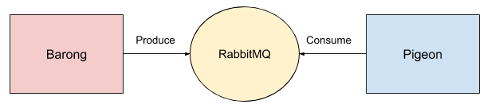

# Pigeon

> :incoming_envelope: Mail events consumer.

[Barong](https://www.github.com/rubykube/barong) Event API Client.

## Overview

Consume mail events from barong and send emails over SMTP.



## Usage

Start worker by running command below

```sh
$ go run ./cmd/pigeon/main.go
```

### Environment variables

| Variable            | Description                  | Required | Default                  |
|---------------------|------------------------------|----------|--------------------------|
| `JWT_PUBLIC_KEY`    | RSA Public Key for decoding  | *yes*    |                          |
| `RABBITMQ_HOST`     | Host of RabbitMQ daemon      | *no*     | `localhost`              |
| `RABBITMQ_PORT`     | Port of RabbitMQ daemon      | *no*     | `5672`                   |
| `RABBITMQ_USERNAME` | RabbitMQ username            | *no*     | `guest`                  |
| `RABBITMQ_PASSWORD` | RabbitMQ password            | *no*     | `guest`                  |
| `SMTP_HOST`         | Host of mail relay (postfix) | *no*     | `localhost`              |
| `SMTP_PORT`         | Port of mail relay (postfix) | *no*     | `25`                     |
| `SENDER_EMAIL`      | Email address of sender      | *no*     | `example@domain.com`     |
| `FRONTEND_DOMAIN`   | Domain of platform UI        | *no*     | `http://www.example.com` |

## License

Project released under the terms of the MIT [license](./LICENSE).
