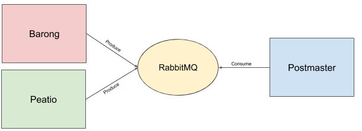

# Pigeon

> :incoming_envelope: Mail events consumer.

[Barong](https://www.github.com/rubykube/barong) Event API Client.

## Overview

Consume mail events from barong and send emails over SMTP.



## Usage

Start worker by running command below

```sh
$ go run ./cmd/pigeon/main.go
```

### Environment variables

- `RABBITMQ_HOST` - Host of RabbitMQ daemon.
- `RABBITMQ_PORT` - Port of RabbitMQ daemon.
- `RABBITMQ_USERNAME` - RabbitMQ username.
- `RABBITMQ_PASSWORD` - RabbitMQ password.
- `JWT_PUBLIC_KEY` - RSA public key to verify and decode JWT tokens.

## License

